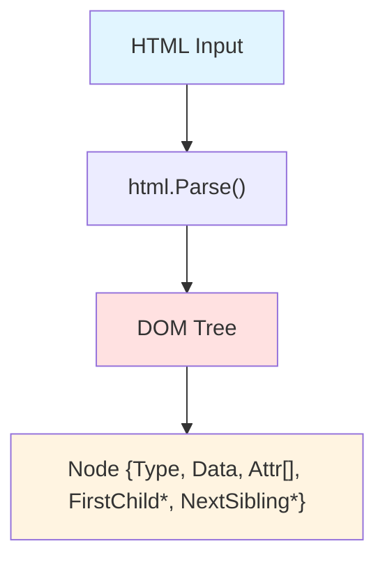
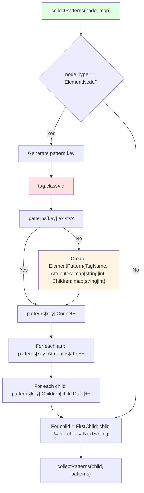
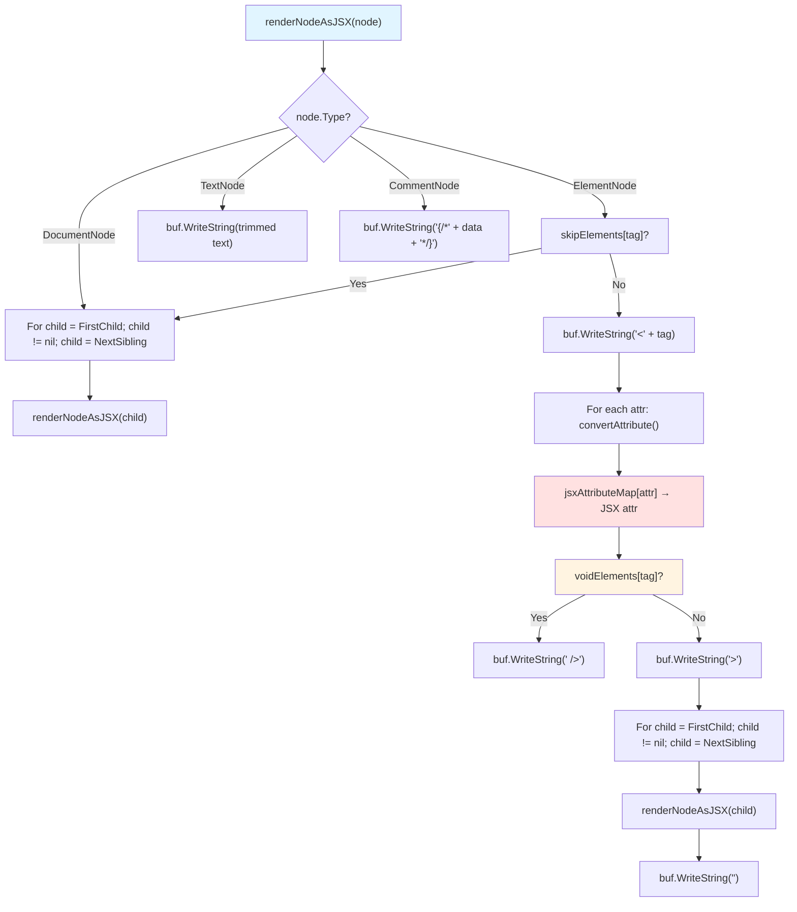
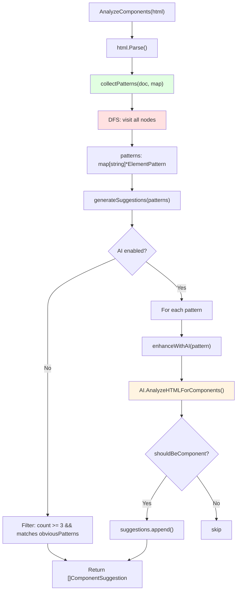
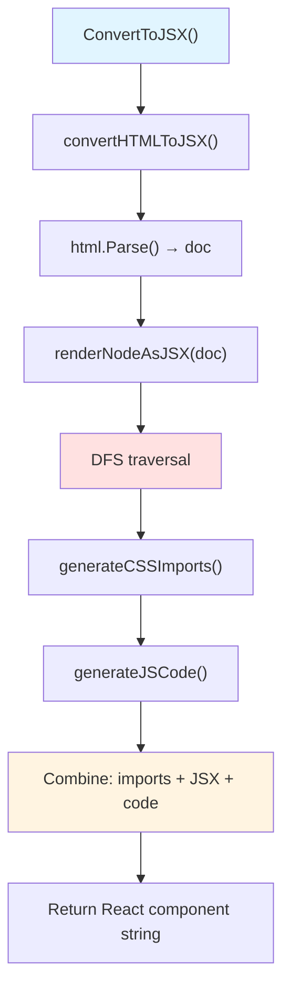
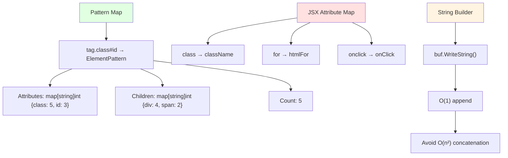

```mermaid
graph TD
    A["HTML Input"] --> B["html.Parse()"]
    B --> C["DOM Tree"]
    C --> D["Node {Type, Data, Attr[], FirstChild*, NextSibling*}"]
    
    style A fill:#e1f5ff
    style C fill:#ffe1e1
    style D fill:#fff4e1
```

```mermaid
graph TD
    A["collectPatterns(node, map)"] --> B{"node.Type == ElementNode?"}
    B -->|Yes| C["Generate pattern key"]
    C --> D["tag.class#id"]
    D --> E["patterns[key] exists?"]
    E -->|No| F["Create ElementPattern{TagName, Attributes: map[string]int, Children: map[string]int}"]
    E -->|Yes| G["patterns[key].Count++"]
    F --> G
    G --> H["For each attr: patterns[key].Attributes[attr]++"]
    H --> I["For each child: patterns[key].Children[child.Data]++"]
    I --> J["For child = FirstChild; child != nil; child = NextSibling"]
    J --> K["collectPatterns(child, patterns)"]
    B -->|No| J
    
    style A fill:#e1ffe1
    style D fill:#ffe1e1
    style F fill:#fff4e1
```

```mermaid
graph TD
    A["renderNodeAsJSX(node)"] --> B{"node.Type?"}
    B -->|DocumentNode| C["For child = FirstChild; child != nil; child = NextSibling"]
    C --> D["renderNodeAsJSX(child)"]
    B -->|ElementNode| E["skipElements[tag]?"]
    E -->|Yes| C
    E -->|No| F["buf.WriteString('<' + tag)"]
    F --> G["For each attr: convertAttribute()"]
    G --> H["jsxAttributeMap[attr] → JSX attr"]
    H --> I["voidElements[tag]?"]
    I -->|Yes| J["buf.WriteString(' />')"]
    I -->|No| K["buf.WriteString('>')"]
    K --> L["For child = FirstChild; child != nil; child = NextSibling"]
    L --> M["renderNodeAsJSX(child)"]
    M --> N["buf.WriteString('</' + tag + '>')"]
    B -->|TextNode| O["buf.WriteString(trimmed text)"]
    B -->|CommentNode| P["buf.WriteString('{/*' + data + '*/}')"]
    
    style A fill:#e1f5ff
    style H fill:#ffe1e1
    style I fill:#fff4e1
```

```mermaid
graph TD
    A["AnalyzeComponents(html)"] --> B["html.Parse()"]
    B --> C["collectPatterns(doc, map)"]
    C --> D["DFS: visit all nodes"]
    D --> E["patterns: map[string]*ElementPattern"]
    E --> F["generateSuggestions(patterns)"]
    F --> G{"AI enabled?"}
    G -->|No| H["Filter: count >= 3 && matches obviousPatterns"]
    G -->|Yes| I["For each pattern"]
    I --> J["enhanceWithAI(pattern)"]
    J --> K["AI.AnalyzeHTMLForComponents()"]
    K --> L{"shouldBeComponent?"}
    L -->|Yes| M["suggestions.append()"]
    L -->|No| N["skip"]
    M --> O["Return []ComponentSuggestion"]
    H --> O
    
    style C fill:#e1ffe1
    style D fill:#ffe1e1
    style K fill:#fff4e1
```

```mermaid
graph TD
    A["ConvertToJSX()"] --> B["convertHTMLToJSX()"]
    B --> C["html.Parse() → doc"]
    C --> D["renderNodeAsJSX(doc)"]
    D --> E["DFS traversal"]
    E --> F["generateCSSImports()"]
    F --> G["generateJSCode()"]
    G --> H["Combine: imports + JSX + code"]
    H --> I["Return React component string"]
    
    style A fill:#e1f5ff
    style E fill:#ffe1e1
    style H fill:#fff4e1
```

```mermaid
graph TD
    A["Pattern Map"] --> B["tag.class#id → ElementPattern"]
    B --> C["Attributes: map[string]int {class: 5, id: 3}"]
    B --> D["Children: map[string]int {div: 4, span: 2}"]
    B --> E["Count: 5"]
    
    F["JSX Attribute Map"] --> G["class → className"]
    F --> H["for → htmlFor"]
    F --> I["onclick → onClick"]
    
    J["String Builder"] --> K["buf.WriteString()"]
    K --> L["O(1) append"]
    L --> M["Avoid O(n²) concatenation"]
    
    style A fill:#e1ffe1
    style F fill:#ffe1e1
    style J fill:#fff4e1
```
