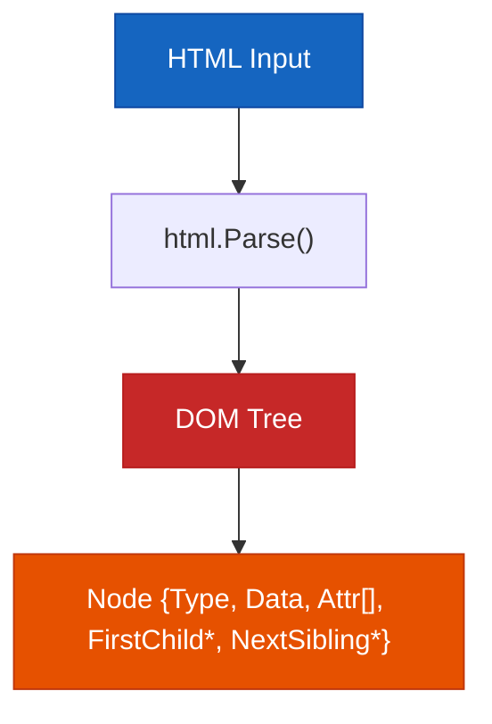
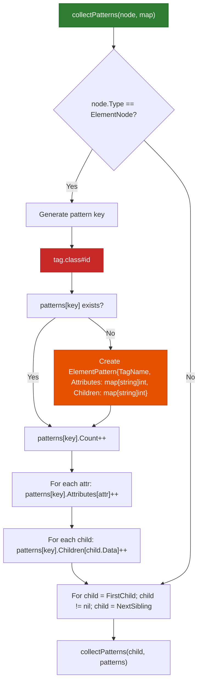
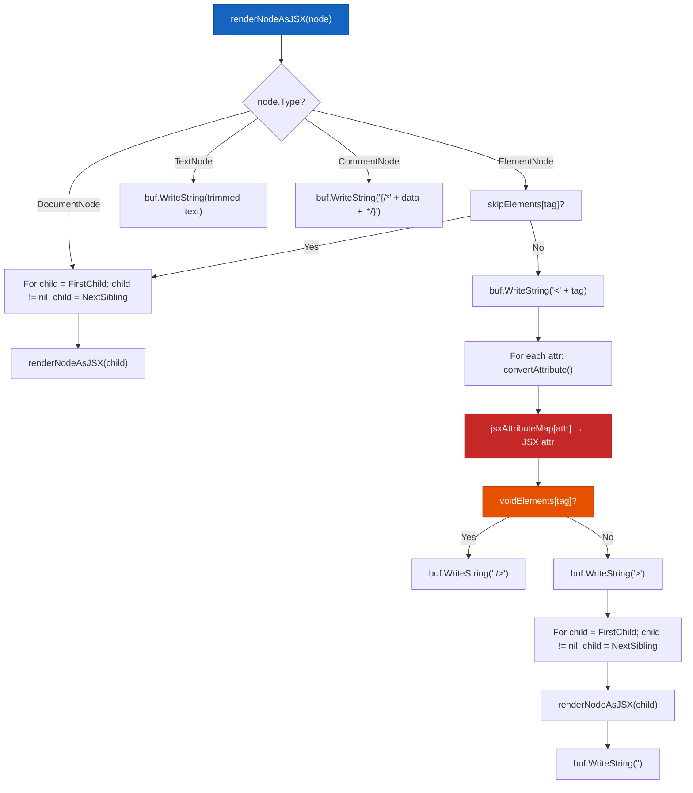
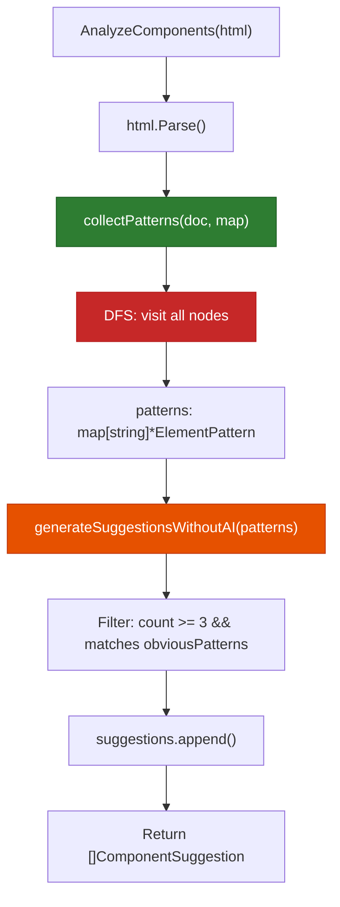
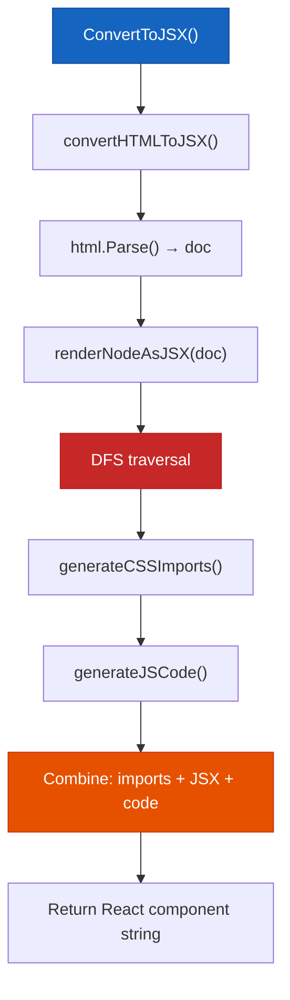
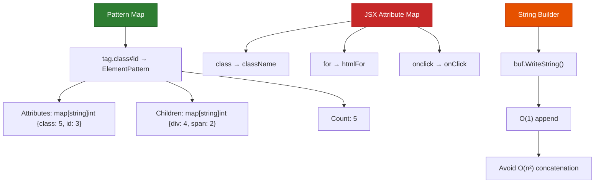

# uncluster

> **Break apart the blob. Ship modern code.**

`uncluster` is a Go-based HTML transformation server. It parses raw HTML into a DOM tree, analyzes its structure, and produces clean outputs — formatted HTML, separated CSS/JS files, React JSX/TSX components, or full scaffolded Node.js projects. It exposes a REST API built on the Fiber framework and ships a standalone CLI tool for local use.

---

## Features

### HTML Formatter
Parses the HTML input and re-renders it with correct indentation and normalized whitespace. Useful as a preprocessing step before any other transformation.

### Resource Extractor
Walks the DOM and separates inline `<style>` and `<script>` blocks into individual files. For externally linked resources (CDN-hosted CSS and JS), it makes HTTP requests to download the actual file content, assigns clean local filenames, and rewrites the `<link>` and `<script src>` references in the HTML to point to the local copies.

### HTML → JSX Converter
Converts HTML markup to valid React JSX. This involves:
- Remapping HTML attributes to their JSX equivalents (`class → className`, `for → htmlFor`, event handlers like `onclick → onClick`)
- Converting inline `style` strings to JavaScript style objects
- Detecting repeated list patterns and generating TypeScript interfaces with `.map()` render loops
- Skipping page-level boilerplate elements (`<html>`, `<head>`, `<body>`)
- Wrapping the output in a complete, importable React component

### Component Analyzer
Performs a depth-first traversal of the DOM and builds a frequency map of elements keyed by `tag.class#id`. Elements that appear 3+ times and whose class names match a set of known UI patterns (`card`, `button`, `modal`, `nav-item`, `form-field`, etc.) are returned as component suggestions, each with a generated name, description, prop list, and starter JSX code.

### Node.js Project Scaffolder
Takes the extracted HTML, CSS, and JS and generates a complete Express + Vite project structure. Output files include `package.json`, `vite.config.js`, `server.js`, `tsconfig.json`, `.eslintrc.json`, `.prettierrc`, and `.gitignore`, with source files organized under `src/`. Everything is packaged into a downloadable ZIP archive.

### EJS Project Scaffolder
Same extraction pipeline, but targets server-side rendering. The HTML is split into EJS partials (header, footer, and page sections), wired into an Express app with `res.render()` routes, and packaged as a ZIP with `views/` and `public/` directories following Express conventions.

---

## How it works

### Step 1 — Parse: HTML string → DOM tree

Every operation starts with `html.Parse()` from Go's `golang.org/x/net/html` package. This produces a linked tree of nodes. Each node holds its type (element, text, comment, document), its tag name and attributes, and pointers to its first child and next sibling — the standard DOM tree structure that every subsequent step traverses.



---

### Step 2 — Analyze: Collect element patterns via DFS

`collectPatterns` does a depth-first traversal of the tree. For each `ElementNode`, it generates a string key in the form `tag.class#id` and looks it up in a map. On the first occurrence a new `ElementPattern` struct is created, tracking the tag name, a frequency count of each attribute, and a frequency count of each direct child tag. On subsequent occurrences the counters increment. By the end of the traversal the map describes the full frequency distribution of element structures across the document.



---

### Step 3 — Render: DOM node → JSX string

`renderNodeAsJSX` recursively visits every node and writes JSX to a `strings.Builder`. Structural page elements are skipped. For each `ElementNode`, attributes are run through `jsxAttributeMap` (a `map[string]string` of 70+ HTML-to-JSX attribute translations). Void elements (``, `<input>`, etc.) get self-closing JSX syntax. Text nodes are trimmed and written inline. HTML comments become JSX comment blocks `{/* */}`.



---

### Step 4 — Suggest: Heuristic component detection

`generateSuggestionsWithoutAI` filters the pattern map using two criteria: the pattern must appear at least 3 times, and its key must contain a substring matching a predefined set of semantic UI identifiers (`card`, `button`, `btn`, `modal`, `nav-item`, `form-field`, etc.). Purely structural elements (`div`, `span`, `section`, `header`, `li`, etc.) are excluded by a separate blocklist. Matching patterns are returned as `ComponentSuggestion` structs with generated names, prop lists, and starter JSX.



---

### Step 5 — Assemble: Compose the final React component

`ConvertToJSX` coordinates the full pipeline. After `renderNodeAsJSX` produces the JSX body, `generateCSSImports` builds the stylesheet import statements from any extracted CSS files, and `generateJSCode` wraps any extracted script logic. The three parts are concatenated into a single component string and returned to the caller.



---

### Key data structures

Three structures do the heavy lifting. The **Pattern Map** is a `map[string]*ElementPattern` that stores frequency data for every element type seen during traversal. The **JSX Attribute Map** is a static `map[string]string` used for O(1) attribute translation at render time. Output is written using `strings.Builder` for O(1) appends — avoids the O(n²) cost of repeated string concatenation in Go.



---

## Getting started

```bash
git clone https://github.com/yourusername/uncluster
cd uncluster
go run .
# Server starts on :3000
```

Static frontend assets are served from `./dist` at `/`.

---

## CLI — `uncluster-split`

A standalone binary that runs the extraction pipeline locally without starting the HTTP server. Reads a single HTML file, separates inline and external resources, and writes the output to a directory. Optionally writes a `split-manifest.json` enumerating every output file and its type.

```bash
go run ./cmd/uncluster-split -input <file.html> -output <dir> [-manifest true]
```

| Flag | Required | Description |
|---|---|---|
| `-input` | yes | Path to the HTML file to process |
| `-output` | yes | Directory to write split output files |
| `-manifest` | no | Write `split-manifest.json` (default: `true`) |

---

## API endpoints

All endpoints accept `application/json`. Export endpoints return `application/zip`.

| Method | Path | Description |
|---|---|---|
| `POST` | `/api/format` | Re-indent and normalize HTML |
| `POST` | `/api/convert` | Convert HTML to a React JSX component |
| `POST` | `/api/analyze` | Return component suggestions from DOM pattern analysis |
| `POST` | `/api/export` | Extract CSS/JS resources and return a ZIP |
| `POST` | `/api/export-nodejs` | Scaffold an Express + Vite + TypeScript project ZIP |
| `POST` | `/api/export-nodejs-ejs` | Scaffold an Express + EJS server-rendered project ZIP |
| `GET`  | `/api/health` | Health check |

---

## Configuration

| Variable | Description |
|---|---|
| `PORT` | HTTP server port (default: `3000`) |

---

## Stack

- **Language**: Go 1.21
- **Web framework**: [Fiber v2](https://github.com/gofiber/fiber)
- **HTML parsing**: `golang.org/x/net/html`
- **Project templates**: `text/template`
- **Archive output**: `archive/zip`

---

## License

MIT
